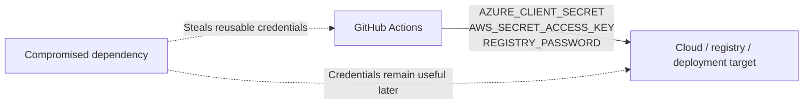
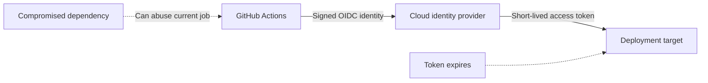
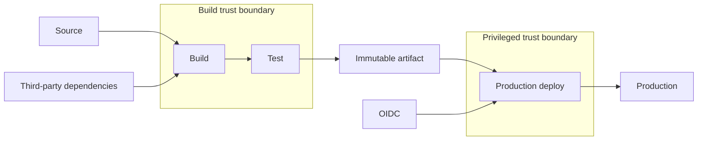

The LiteLLM supply-chain compromise is a useful reminder that the most dangerous place to steal credentials is often not a developer laptop. It is the CI/CD runner.

A build runner can have access to source control, package registries, cloud subscriptions, deployment environments, signing infrastructure and API keys. Compromise a dependency that executes there and you may not need to attack any of those systems directly. The pipeline already has permission to reach them.

That raises an interesting question: **would OpenID Connect have protected organisations affected by the LiteLLM attack?**

The answer is yes, substantially, but not completely.

OIDC does not stop malicious code from running inside a trusted build. What it changes is the value and lifetime of the credentials that code can steal.

---

## What Happened With LiteLLM

On 24 March 2026, malicious versions `1.82.7` and `1.82.8` of the LiteLLM Python package were published after an attacker obtained access to a maintainer’s PyPI account.

LiteLLM was not the beginning of the story. [JFrog’s incident analysis](https://research.jfrog.com/post/litellm-compromised-teampcp/) traces the path through a compromised Trivy GitHub Action: credentials harvested from a privileged CI/CD pipeline were then used to reach LiteLLM’s publishing process. That is the supply-chain pattern worth paying attention to — compromise a trusted tool upstream, steal pipeline credentials, then use those credentials to compromise something downstream that other organisations trust.

According to the [LiteLLM security incident](https://github.com/BerriAI/litellm/issues/24518), the malicious package attempted to collect credentials including:

- environment variables
- AWS, Azure and GCP credentials
- Kubernetes credentials
- SSH keys
- database passwords
- SSL private keys
- CI/CD configuration

Version `1.82.7` embedded the payload in `litellm/proxy/proxy_server.py` and triggered when `litellm.proxy` was imported.

Version `1.82.8` was nastier. It added a Python `.pth` file that could execute during interpreter startup. The application did not even have to deliberately import LiteLLM for the malicious code to run.

Later reporting made the potential scale harder to dismiss. Researchers analysing an alleged attacker archive reported 153 GB of material: 433,909 files, including 118,829 CI/CD runner dumps attributed to 2,488 organisations. Those figures and any company names associated with them should be treated as exposure indicators, not as independently confirmed breaches of every named organisation. But the data is a useful illustration of the risk: CI runners often contain signing material, cloud credentials and AI-provider API keys in one very attractive place.

The campaign was also broader than one Python package. [CloudSEK’s analysis](https://www.cloudsek.com/blog/the-scanner-was-the-weapon-36-months-of-precision-supply-chain-attacks-against-devsecops-infrastructure) describes the use of a `.pth` startup hook and the collection of cloud, Kubernetes and database credentials. In other words, the attack path was not merely “someone installed a bad library”; it was an upstream CI compromise that could create a downstream credential-harvesting event across many environments.

If that happened inside a CI runner full of long-lived credentials, the attacker could exfiltrate secrets that remained useful long after the job finished.

That is the part OIDC changes.

---

## The Problem With Long-Lived CI Secrets

The traditional deployment model looks something like this:



The credentials are created ahead of time, stored as GitHub secrets and injected into the job when required.

This works, but it creates a valuable object for malware to steal.

If a dependency executes:

```python
import os
print(os.environ)
```

and the runner contains a reusable cloud credential, the attacker does not necessarily need to do anything immediately. They can take the secret away and use it later from somewhere else.

Its useful lifetime might be weeks, months or years.

The incident response then becomes a race to discover which secrets were exposed and rotate all of them before they are abused.

---

## OIDC Removes the Permanent Cloud Secret

With OIDC, the workflow proves its identity to the cloud provider and exchanges that identity for a short-lived access token.

GitHub describes the model as replacing long-lived cloud secrets with tokens that are issued for a job and then expire automatically. See the [GitHub Actions OIDC documentation](https://docs.github.com/en/actions/concepts/security/openid-connect).

Conceptually:



There is no reusable Azure client secret or AWS access key sitting in the repository secrets waiting to be copied.

For Azure, for example, GitHub Actions can authenticate through a federated identity credential associated with a Microsoft Entra application or managed identity. Microsoft documents this pattern for [`azure/login`](https://learn.microsoft.com/en-us/azure/developer/github/connect-from-azure-openid-connect).

A simplified workflow might look like this:

```yaml
permissions:
  contents: read
  id-token: write

jobs:
  deploy:
    environment: production
    runs-on: ubuntu-latest

    steps:
      - uses: actions/checkout@v4

      - uses: azure/login@v2
        with:
          client-id: ${{ vars.AZURE_CLIENT_ID }}
          tenant-id: ${{ vars.AZURE_TENANT_ID }}
          subscription-id: ${{ vars.AZURE_SUBSCRIPTION_ID }}

      - run: az webapp deploy ...
```

Under the covers, the `id-token: write` permission allows the job to ask GitHub for a signed OIDC token. Actions such as `azure/login` handle this exchange for you, but the underlying request is roughly:

```yaml
- name: Request a GitHub OIDC token
  shell: bash
  run: |
    oidc_token="$(curl -sS \
      -H "Authorization: bearer $ACTIONS_ID_TOKEN_REQUEST_TOKEN" \
      "${ACTIONS_ID_TOKEN_REQUEST_URL}&audience=api://AzureADTokenExchange" \
      | jq -r .value)"

    # Exchange $oidc_token with the cloud provider. Never print it.
```

GitHub signs that token with claims about the repository, branch and environment. The cloud provider validates those claims against its federated-identity policy, then issues the short-lived credential. The workflow normally uses `azure/login` rather than implementing this request itself.

The identifiers above are not equivalent to a reusable client secret. The useful credential is obtained dynamically after GitHub proves the identity of the workflow.

If malicious code dumps the environment, there is no permanent Azure password to take home.

That is a major improvement.

---

## But the Attacker Is Already Inside the Job

This is where the security story becomes more subtle.

OIDC protects against **credential persistence**, not against **execution inside the trusted workload**.

If malicious code is already running in a job that is allowed to request an OIDC token, that code may be able to obtain or use the same short-lived credentials as the legitimate deployment process.

In other words, the attacker may not be able to steal a key that works next month, but they may still be able to act as the deployment job *right now*.

The difference looks roughly like this:

| Attack capability | Long-lived secret | OIDC |
|---|---:|---:|
| Steal a reusable cloud credential | Yes | Usually no |
| Use the job’s cloud permissions while it runs | Yes | Yes |
| Continue using the same credential later | Yes | Limited by token lifetime |
| Require emergency rotation of a permanent cloud password | Usually | Usually not |
| Protect unrelated API keys present in the job | No | No |

That last row matters.

If your build still contains an OpenAI API key, Anthropic API key, database password, signing key or some other bearer credential that does not support workload federation, malicious code may still copy it.

OIDC is not magic secret-be-gone dust.

It simply removes a large and particularly dangerous class of secrets from the runner.

---

## OIDC Turns Credential Theft Into Temporary Capability Theft

This is the useful mental model.

With long-lived credentials, a compromised build can give an attacker a durable identity.

With OIDC, a compromised build is more likely to give the attacker a temporary capability.

That capability can still be dangerous. A production deployment identity with `Owner` over an Azure subscription is dangerous whether its token lasts ten minutes or ten years.

But the response problem is fundamentally different.

A stolen permanent credential means:

1. identify the exposed key
2. revoke it
3. create another one
4. distribute it safely
5. update every consumer
6. hope the attacker has not created persistence elsewhere

A stolen short-lived token means its direct usefulness expires automatically.

You still need to investigate what the attacker did while it was valid, but you are no longer depending entirely on your detection speed to make the credential useless.

---

## Least Privilege Matters More, Not Less

OIDC works best when combined with narrow identities.

A deployment job should not authenticate as a general-purpose automation account with permissions across the whole organisation.

Instead, split responsibilities:

```text
build
  -> no production access

test
  -> no production access

publish-package
  -> package registry only

deploy-dev
  -> development resources only

deploy-production
  -> production deployment permissions only
```

The OIDC trust relationship can also restrict *which* repository, branch or environment may obtain a role. GitHub’s [OIDC reference](https://docs.github.com/en/actions/reference/security/oidc) documents subject claims that can identify repositories, branches and environments.

A production identity should ideally require something closer to:

```text
repository = payments-api
environment = production
role = deployment-only
```

rather than:

```text
anything in the organisation = Contributor
```

GitHub also recommends using environment protection rules when environments participate in OIDC policies. That gives you another boundary before a workflow can reach a sensitive identity.

---

## Separate Jobs So Malicious Code Sees Less

One of the easiest mistakes in CI/CD is putting everything into one enormous job.

For example:

```text
restore dependencies
build
test
package
authenticate to Azure
authenticate to NuGet
sign binaries
deploy production
```

Now every dependency executed near the beginning potentially shares a trust boundary with every credential introduced later.

A better architecture separates those responsibilities and passes immutable artifacts between them.

The build job should not need production credentials at all.

The production deployment job should ideally consume an already-built artifact and contain as little arbitrary third-party execution as possible.



That does not eliminate supply-chain attacks, but it dramatically reduces what a compromised build dependency can reach.

---

## OIDC Is One Layer of the Supply-Chain Defence

The broader lesson from LiteLLM is not simply “use OIDC”.

A resilient pipeline stacks controls:

1. **Use OIDC or workload identity federation wherever possible.** Remove permanent cloud credentials from CI.
2. **Apply least privilege.** A temporary `Owner` token is still an `Owner` token.
3. **Separate build and deployment jobs.** Do not expose production identity to dependency installation unless necessary.
4. **Protect production environments.** Restrict branches, tags and approvals that can reach them.
5. **Pin and verify dependencies and actions.** Reduce surprise changes in executable build inputs.
6. **Minimise remaining bearer secrets.** If an API still requires a static key, expose it only to the specific job that needs it.
7. **Prefer ephemeral runners.** A compromised build machine should not become persistent infrastructure.
8. **Use provenance and attestations where practical.** GitHub’s [artifact attestations](https://docs.github.com/en/actions/concepts/security/artifact-attestations) can establish where and how an artifact was built, although provenance does not prove the artifact itself is safe.

No single item solves the problem.

Together they turn a CI compromise from “the attacker now owns a bag of permanent keys” into something much more constrained.

---

## The Goal Is Not to Make Compromise Impossible

That is not a realistic target for a modern software supply chain.

Your build executes code from package managers, build tools, GitHub Actions, container images and internal scripts. Somewhere in that graph, eventually, something will be compromised.

The more useful question is:

> If malicious code executes in my pipeline, what can it take with it when the process ends?

With long-lived deployment credentials, the answer may be your cloud identity.

With well-designed OIDC federation, least privilege and isolated deployment jobs, the answer can be much smaller:

> It temporarily had the permissions of this specific job.

That is still an incident.

But it is a dramatically better incident to have.
